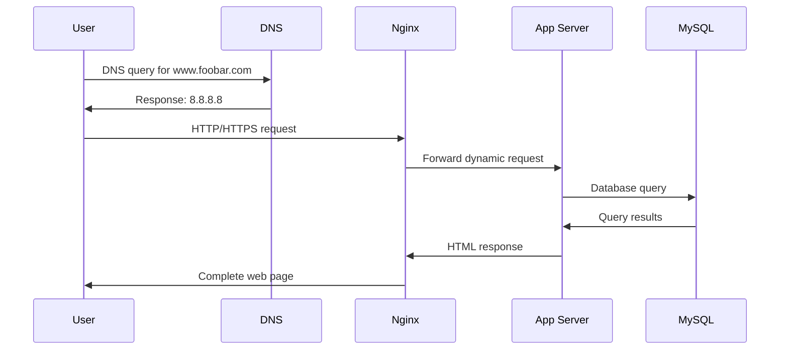

# Simple One-Server Web Infrastructure

## Component Explanations
### What is a server?
A server is a computer system or program that provides services, resources, or data to other computers (clients) over a network. In this infrastructure, it's a physical or virtual machine hosting all the components needed to serve the website.

### Role of the domain name
The domain name (foobar.com) provides a human-readable address that translates to an IP address (8.8.8.8) through DNS. It acts as an easy-to-remember identifier instead of requiring users to remember numerical IP addresses.

### DNS record type for www
The "www" in www.foobar.com is a CNAME record (Canonical Name record) that points to the domain foobar.com, which then resolves to the IP address 8.8.8.8 through an A record.

### Role of the web server (Nginx)
Receives HTTP/HTTPS requests from users

Serves static content (HTML, CSS, JavaScript, images)

Acts as a reverse proxy to forward dynamic requests to the application server

Handles SSL/TLS termination

Manages load balancing (in more complex setups)

### Role of the application server
Executes the application logic and business rules

Processes dynamic content generation

Handles user authentication and session management

Communicates with the database to retrieve/store data

Renders templates to generate HTML responses

### Role of the database (MySQL)
Stores and manages persistent data (user accounts, content, settings)

Provides data integrity and security

Handles data relationships through tables

Optimizes queries for efficient data retrieval

### Server communication with user's computer
The server communicates with the user's computer using the HTTP/HTTPS protocol over TCP/IP. This includes:

HTTP requests (GET, POST, etc.) from the user's browser

HTTP responses containing HTML, CSS, JavaScript, and other resources

TCP/IP for reliable data transmission

### Issues with This Infrastructure
### 1. Single Point of Failure (SPOF)
- The entire website goes down if the single server fails

- Hardware failures, power outages, or network issues affect all components simultaneously

- No redundancy for any component (web server, application server, or database)

### 2. Downtime during maintenance
- Deploying new code requires restarting services, causing downtime

- Database maintenance or backups impact website availability

- Operating system updates require server reboots

- Any maintenance activity affects the entire system

### 3. Scaling limitations
- Cannot handle significant traffic increases due to limited server resources (CPU, RAM, bandwidth)

- All components compete for the same finite resources

- No horizontal scaling capability - cannot add more servers to distribute load

- Database becomes a bottleneck under heavy read/write operations

### 4. Additional issues:
- Security vulnerabilities: Compromise of one component can lead to full system access

- Performance bottlenecks: All services running on same hardware compete for resources

- Limited geographic reach: Single server location may cause latency for distant users

- Backup challenges: Difficult to perform live backups without affecting performance

- This simple infrastructure is suitable for small projects or development environments but requires significant enhancements for production use with real traffic.