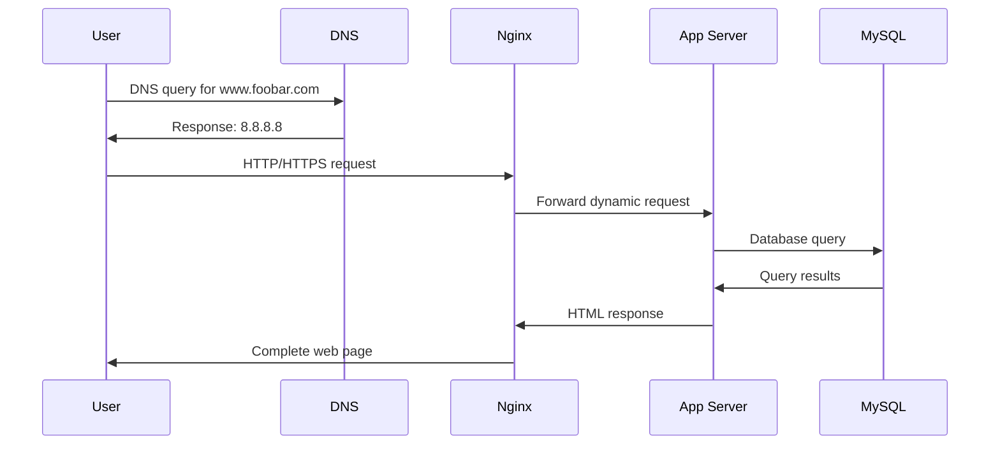

```mermaid

sequenceDiagram
    participant U as User
    participant D as DNS
    participant N as Nginx
    participant A as App Server
    participant DB as MySQL
    
    U->>D: DNS query for www.foobar.com
    D->>U: Response: 8.8.8.8
    U->>N: HTTP/HTTPS request
    N->>A: Forward dynamic request
    A->>DB: Database query
    DB->>A: Query results
    A->>N: HTML response
    N->>U: Complete web page

```