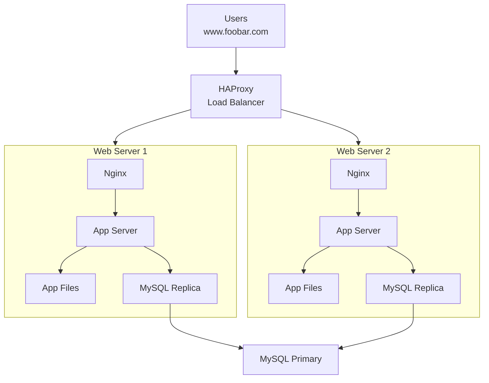

# Distributed web infrastructure
## Infrastructure Design

## Infrastructure Components Explanation
### Why Each Element Was Added:
### 1. Load Balancer (HAProxy)

- Purpose: Distributes incoming traffic across multiple servers

- Benefit: Prevents single server overload and provides high availability

- Result: Improved performance and fault tolerance

### 2. Second Web Server

- Purpose: Provides redundancy and load distribution

- Benefit: If one server fails, the other can handle traffic

- Result: Eliminates web/application server as SPOF

### 3. Database Primary-Replica Cluster

- Purpose: Database redundancy and read scalability

- Benefit: Replica can handle read queries, Primary handles writes

- Result: Improved database performance and availability

## Load Balancer Configuration
### Distribution Algorithm: Round Robin
- How it works: Distributes requests sequentially to each server in rotation

- Example: Request 1 → Server 1, Request 2 → Server 2, Request 3 → Server 1, etc.

- Advantage: Simple and evenly distributes load

### Active-Active vs Active-Passive Setup
Active-Active Setup (This Infrastructure)

- Both servers handle traffic simultaneously

- Load balancer distributes requests to both servers

- Advantage: Better resource utilization, higher throughput

- Use case: High traffic websites, load distribution

Active-Passive Setup

- Only one server (active) handles traffic

- Second server (passive) is on standby

- Failover: Passive becomes active if primary fails

- Advantage: Simpler data consistency, easier setup

- Use case: Critical applications where data consistency is paramount