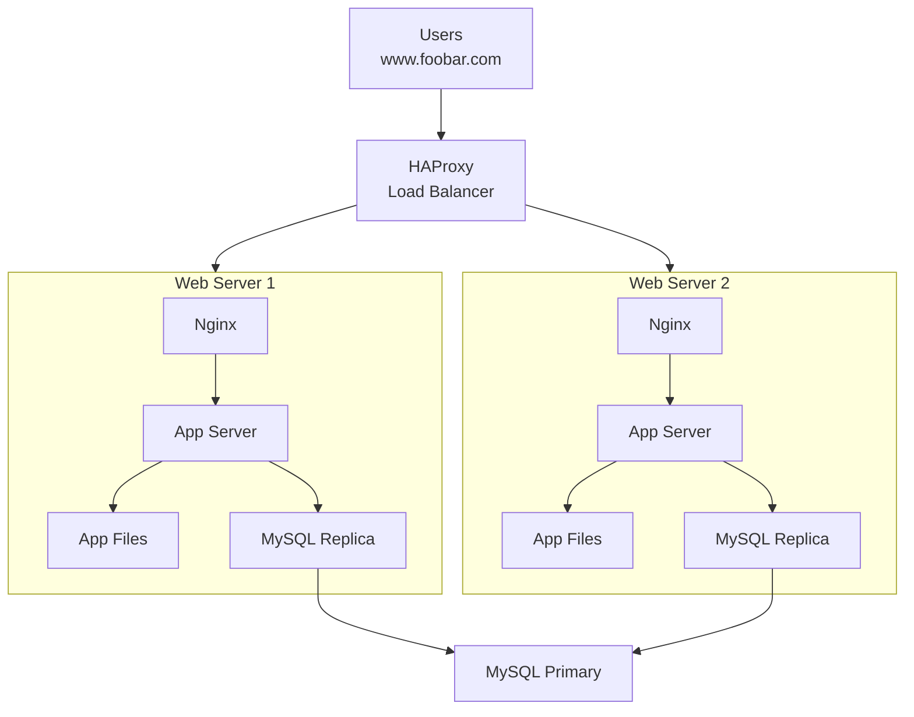

```mermaid
graph TB
    A[Users<br/>www.foobar.com] --> B[HAProxy<br/>Load Balancer]
    
    B --> C[Server 1]
    B --> D[Server 2]
    
    subgraph C [Web Server 1]
        E[Nginx] --> F[App Server]
        F --> G[App Files]
        F --> H[MySQL Replica]
    end
    
    subgraph D [Web Server 2]
        I[Nginx] --> J[App Server]
        J --> K[App Files]
        J --> L[MySQL Replica]
    end
    
    H --> M[MySQL Primary]
    L --> M

```