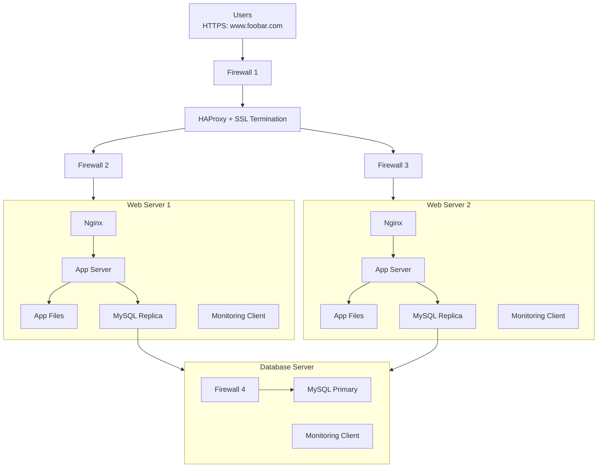

# Secured and monitored web infrastructure
## Infrastructure Design

## Additional Components Explanation
### Why Each Element Was Added:
1. Three Firewalls
- Firewall 1: Protects load balancer from external attacks

- Firewall 2/3: Isolate web servers from internal threats

- Firewall 4: Protects database server with strict rules

- Purpose: Defense in depth strategy
2. SSL Certificate for HTTPS

- Purpose: Encrypts data between users and servers

- Benefit: Protects sensitive information and builds trust

- Implementation: Terminated at load balancer level

3. Three Monitoring Clients

- Purpose: Collect metrics from all critical components

- Benefit: Real-time visibility into system health

- Use: Performance tracking and alerting

### Why Traffic Served Over HTTPS?
HTTPS provides:

- Encryption: Prevents eavesdropping on sensitive data

- Data Integrity: Ensures data isn't modified in transit

- Authentication: Verifies server identity to prevent spoofing

- SEO Benefits: Google ranking preference for HTTPS sites

- User Trust: Browser padlock icon builds confidence

### What Monitoring is Used For?
Monitoring provides:

- Performance Tracking: CPU, memory, disk, network usage

- Availability Monitoring: Uptime/downtime tracking

- Security Monitoring: Detect suspicious activities

- Capacity Planning: Identify when to scale resources

- Troubleshooting: Quick identification of issues