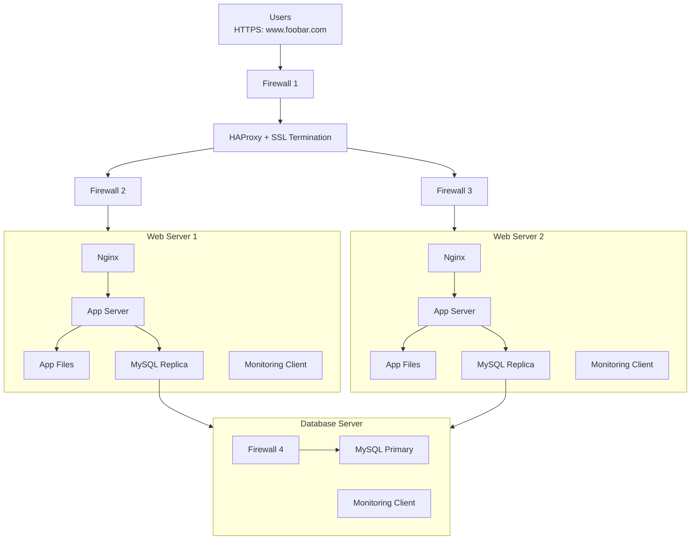

```mermaid

graph TB
    A[Users<br/>HTTPS: www.foobar.com] --> B[Firewall 1]
    B --> C[HAProxy + SSL Termination]
    
    C --> D[Firewall 2]
    C --> E[Firewall 3]
    
    D --> F[Server 1]
    E --> G[Server 2]
    
    subgraph F [Web Server 1]
        H[Nginx] --> I[App Server]
        I --> J[App Files]
        I --> K[MySQL Replica]
        L[Monitoring Client]
    end
    
    subgraph G [Web Server 2]
        M[Nginx] --> N[App Server]
        N --> O[App Files]
        N --> P[MySQL Replica]
        Q[Monitoring Client]
    end
    
    K --> R[MySQL Primary]
    P --> R
    
    subgraph R [Database Server]
        S[Firewall 4]
        S --> T[MySQL Primary]
        U[Monitoring Client]
    end

```
